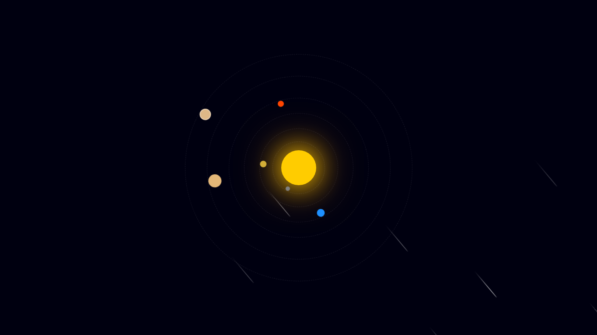

# 🌌 Solar System Animation

A beautiful **Solar System animation** built using **pure HTML and CSS** — no JavaScript required!  
This project features animated **planets orbiting the sun**, **glowing effects**, and **realistic shooting stars** falling diagonally across the night sky.

---

## 🚀 Live Demo

[](https://nazrulislam1835.github.io/Solar-System-Animation/)

---

## 🪐 Features

- 🌞 Glowing animated Sun  
- 🪐 Smooth orbiting planets  
- 🌠 Properly rotated shooting stars with glowing tails  
- ✨ Static twinkling background stars  
- 🎨 100% CSS animations — no JS  
- 📱 Fully responsive design  

---

## ⚙️ Technologies Used

- **HTML5**
- **CSS3** (Keyframes, Transforms, Gradients, Animations)

---

## 🚀 How to Run

1. Clone this repository:
   ```bash
   https://github.com/nazrulislam1835/Solar-System-Animation


## 🚀 Preview


📄 License
This project is licensed under the MIT License — feel free to use and modify it.


👨‍🚀 Author
Nazrul Islam Nabil
✉️ nazrulnabil05@gmail.com
